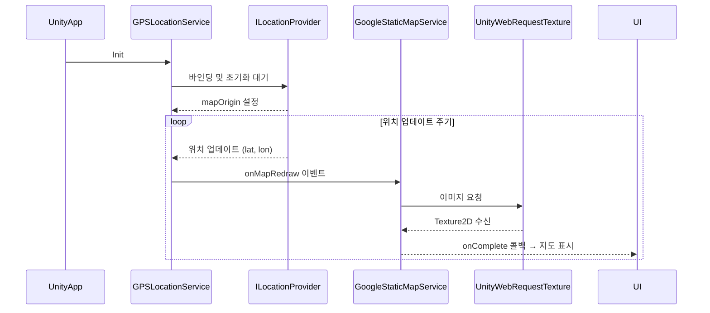
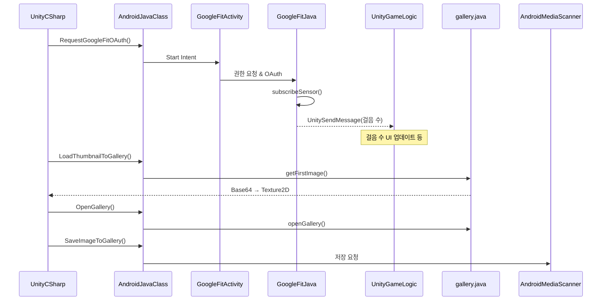
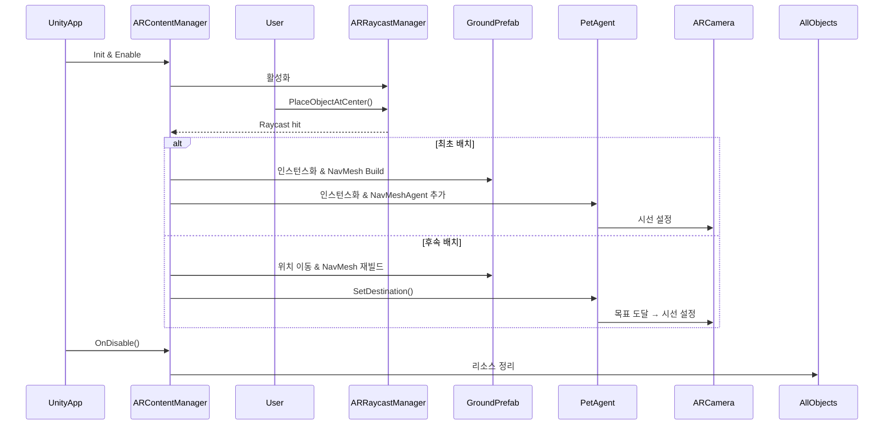

# 🐾 뿌꾸민 – POOKOOMIN

## 🎮 개요

  

닌텐도의 AR 게임 「피크민 블룸」을 보고 영감을 받아 만든 AR 게임입니다. 🌳

* **프로젝트 이름**: Pookoomin 🏠
* **프로젝트 지속기간**: 2025.06.13 ~ 2025.06.27
* **개발 엔진 및 기술**: Unity(AR Foundation), C#, Google static map API, Google Fit API, Android Studio(Java)
* **팀 멤버**: 팀 "뿌꾸의 산책" (김민정, 정보연, 한태규)

---

## 📖 게임 영상

---

## 🕹️ 프로젝트 구현

### Google Static Map API
### 🚀 워크플로우: 현재 위치 기반 지도 로딩 과정

---

### Google Fit API & Android Native Code(Java)

---

### AR Foundation

### 🚀 워크플로우: AR 콘텐츠 인식 및 배치 과정

